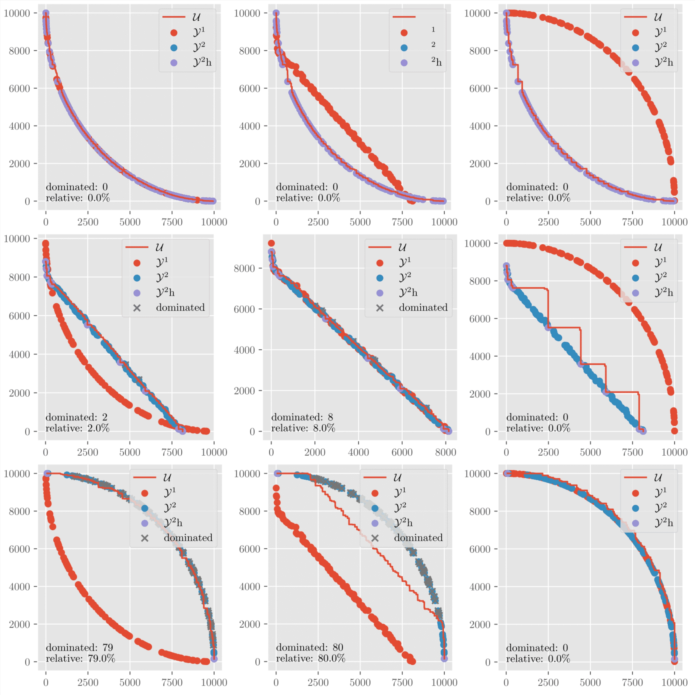
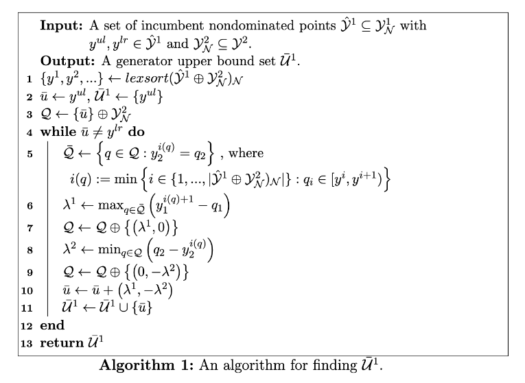
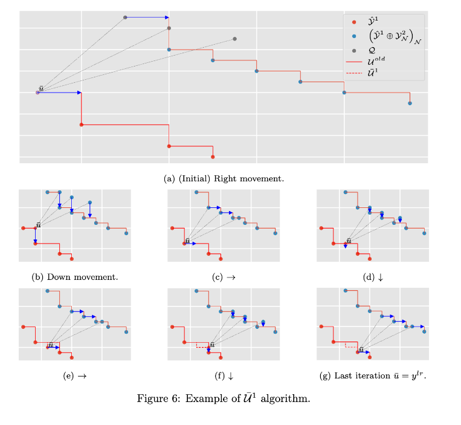

<style type="text/css">
.main-container {
  max-width: 1800px;
  margin-left: auto;
  margin-right: auto;
}
</style>

```{r setup, include=FALSE}
here::i_am("code/instances/algorithm3.Rmd")  # specify relative path given project
# remotes::install_github("relund/gMOIP")
# library(gMOIP)
#library(DT)
library(tidyverse)
library(ggplot2)
# library(knitr)
# library(rgl)
# rgl::setupKnitr()
# options(rgl.useNULL=TRUE)
# rgl::par3d("family" = "serif")
# library(tikzDevice)
knitr::opts_chunk$set(
  echo = FALSE,
  message=FALSE, include = TRUE, warning = FALSE,
  out.width = "69%", fig.width = 12, fig.align = "center", fig.asp = 0.8
)
```

Testsets

-	set_options = [‘l’,‘m’,‘u’] - three different levels of nonsupported points.
-	seed_options = [1,2,3,4,5]
-	size_options = [10,50,100,150, 200] [300, 600]
-	UB_options = [‘lexmin’,‘extreme’,‘0.25’,‘0.5’,‘0.75’,‘all’]

Note:

-	All sets are in p=2 dimensions.
-	For each test the sets $Y^1$ and $Y^2$ are ‘scaled’ the same.


## Statistics for the problems solved using alg3
Testsets

-	In each testset $|Y^1| = |Y^2|$

Given a problem consisting of $2$ subproblems $Y^1$, $Y^2$ and a level of $Y^2$, we find a generator upper bound of $Y^2$ based on the points of $Y^1$ and a subset of  $Y^2$ (based on some level).
Steps:
1.	For each testset do:
2.	Define subset of $Y^2$ based on ub_level - Here we use all extreme points of $Y^2$.
3.	Define generator upper bound of the set  $Y^2$using the sets $Y^2$ and subset of $Y^2$.
4.	Determine the points of  $Y^2$which are dominated by the generator upper bound set.
5.	Record the number of dominated points along with the time spent calculating the generator upper bound set.

The following grid shows an example of the number of dominated points. [size = 100, ub_option = 'extreme']





In the following we plot the relative number of points dominated by the generator upper bound set. We plot this in a grid for different levels of nonsupported points. In each plot we present boxplots for several sizes of the input sets.


```{r}
dat <- read_csv(here::here("code/instances/results/algorithm3/result_slides_alg1_2.csv"))
dat$s1 <- factor(dat$s1)

```

```{r}
dat$t1 <- factor(dat$t1)
dat$t2 <- factor(dat$t2)

t1_labels <- c("l" = "No unsupported Y1", "m" ="Some unsupported Y1", "u" = "Many unsupported Y1")
t1_labeller <- function(variable, value) {
  return(t1_labels[value])
}
t2_labels <- c("l" = "No unsupported Y2", "m" ="Some unsupported Y2", "u" = "Many unsupported Y2")
t2_labeller <- function(variable, value) {
  return(t2_labels[value])
}

dat %>% 
   filter(Y1_size <=300) %>%
   mutate(relative = Yn_size/Y_size) %>%
   ggplot(aes(x = s1, y = relative)) +
   geom_boxplot() + 
   facet_grid(t2 ~ t1, margins = F, labeller = labeller(t1 = t2_labeller, t2 = t1_labeller)) +
   labs(
        y = "Relative number of nondominated points",
        x = "Subproblem size") +
   theme(legend.position = "bottom")
```


# Algorithm 2
Size of the minimum generator sets

MGS size
```{r}

dat %>% 
   filter(Y1_size <=300) %>%
   mutate(MGS_size = G1_size + G2_size) %>%
   ggplot(aes(x = s1, y = MGS_size)) +
   geom_boxplot() + 
   #facet_grid(t2 ~ t1, margins = F, labeller = label_both) +
   facet_grid(t2 ~ t1, margins = F, labeller = labeller(t1 = t2_labeller, t2 = t1_labeller)) +
   labs(
        y = "Size of Minimum generator set",
        x = "Subproblem size") +
   theme(legend.position = "bottom")
```


MGS size relative
```{r}

dat %>% 
   filter(Y1_size <=300) %>%
   mutate(MGS_size_rel = (G1_size + G2_size) / (Y1_size + Y2_size) ) %>%
   ggplot(aes(x = s1, y = MGS_size_rel)) +
   geom_boxplot() + 
   facet_grid(t2 ~ t1, margins = F, labeller = labeller(t1 = t2_labeller, t2 = t1_labeller)) +
   #facet_grid(t2 ~ t1, margins = F, labeller = label_both) +
   labs(
        y = "Relative size of Minimum generator set",
        x = "Subproblem size") +
   theme(legend.position = "bottom")
```

MGS size Y1 relative
```{r}

dat %>% 
   filter(Y1_size <=300) %>%
   mutate(MGS_size_rel = (G2_size) / (Y2_size) ) %>%
   #mutate(MGS_size_rel = (G1_size) / (Y1_size) ) %>%
   ggplot(aes(x = s1, y = MGS_size_rel)) +
   geom_boxplot() + 
   #facet_grid(t2 ~ t1, margins = F, labeller = label_both) +
   facet_grid(t2 ~ t1, margins = F, labeller = labeller(t1 = t2_labeller, t2 = t1_labeller)) +
   labs(
        y = "|G1|/|Y1|",
        x = "Subproblem size") +
   theme(legend.position = "bottom")
```


# Algorithm 3

```{r}
dat <- read_csv(here::here("code/instances/results/algorithm3/result.csv"))
dat$ub_level <- factor(dat$ub_level, levels = c("lexmin", "extreme", as.character(seq(0.25, 0.75, by = 0.25)), "all"))
dat$s1 <- factor(dat$s1)

figures_location <- '../../phd/projects/papers/slidesCORAL/figures/empirical/'

```

```{r}

dat %>% 
   filter(Y1_size <=200) %>%
   filter(ub_level == 'extreme') %>%
   ggplot(aes(x = s1, y = dominated_relative_Y2)) +
   geom_boxplot() + 
   #facet_grid(t2 ~ t1, margins = F, labeller = label_both) +
   facet_grid(t2~ t1, margins = F, labeller = labeller(t1 = t1_labeller, t2 = t2_labeller)) +
   labs(
        y = "% dominated points",
        x = "Subproblem size") +
   theme(legend.position = "bottom")
```


Results: "The more #nonsupported points the more points are dominated by a generator upper bound set"

## In the following we evaluate different levels of partial sets Y2 used for the generator upper bound set
-	UB_options = [‘lexmin’,‘extreme’,‘0.25’,‘0.5’,‘0.75’,‘all’]

In the following we consider the case where only a subset of  $Y^2$is used to define a generator upper bound set. We look at different levels of partial sets $\hat{Y}^2$ defined as follows:

-	‘lexmin’ $\Rightarrow$ $\hat{Y}^2$ consists of only the lexmin solutions.
-	‘extreme’ $\Rightarrow$ $\hat{Y}^2$ consists of only all extreme supported points.
-	‘x%’ $\Rightarrow$ $\hat{Y}^2$ consists of all extreme supported points plus x% of the remaining points (eg. for x= 0.25 $ \hat{Y}^2 = Y^2_{se} \cup $ 25% of the remaining points chosen in lex-order).
-	‘all’ $\Rightarrow$ $\hat{Y}^2$ =$Y^2$


```{r}
dat %>% 
   filter(Y1_size ==200) %>%
   ggplot(aes(x = ub_level, y = dominated_relative_Y2)) +
   geom_boxplot() + 
   #facet_grid(t2 ~ t1, margins = F, labeller = label_both) +
   facet_grid(t2 ~ t1, margins = F, labeller = labeller(t1 = t1_labeller, t2 = t2_labeller)) +
   labs(
      #title = "Relativ number of dominated points given level of partial set Y1, dominated/|Y^2|",
        #y = "%",
        y = "% dominated points",
        x = "Y1 partial level") +
   theme(legend.position = "bottom", axis.text.x = element_text(angle = 90, hjust = 1))
```


In the following we show how long is spent calculating the generator upper bound sets

```{r}
 dat %>% 
   filter(Y1_size ==200) %>%
   ggplot(aes(x = ub_level, y = log(U_time), color=s1)) +
   geom_boxplot() + 
   #facet_grid(t2 ~ t1, margins = F, labeller = label_both) +
   facet_grid(t2 ~ t1, margins = F, labeller = labeller(t1 = t1_labeller, t2 = t2_labeller)) +
   labs(title = "(log) Time spent on calculating generator upper bound",
        y = "(log) time",
        x = "Y2 partial level") +
   theme(legend.position = "bottom", axis.text.x = element_text(angle = 90, hjust = 1))
```


# The algorithm used to find the generator upper bound set

- From report 6860 
- Only works for $p=2$
Notation: Opposite use of $Y^1$ and $Y^2$ with respect to the above.



Example of algorithm run:



