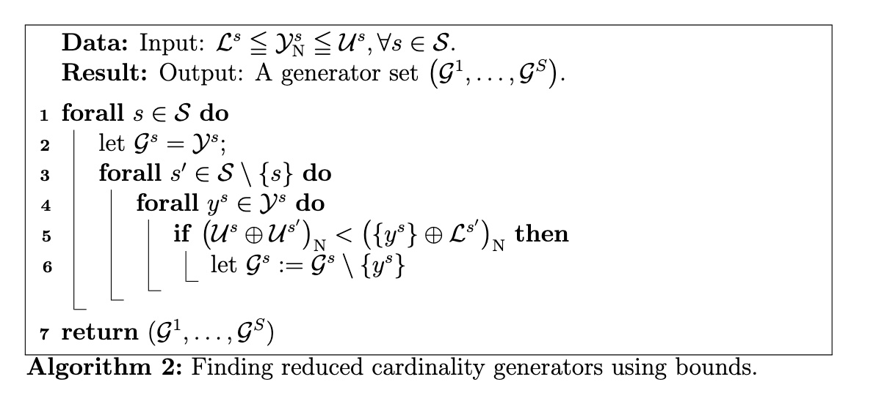

```{=html}
<style type="text/css">
.main-container {
  max-width: 1800px;
  margin-left: auto;
  margin-right: auto;
}
</style>
```
```{r setup, include=FALSE}
here::i_am("code/instances/algorithm3_levels.Rmd")  # specify relative path given project
# remotes::install_github("relund/gMOIP")
# library(gMOIP)
#library(DT)
library(tidyverse)
library(ggplot2)
# library(knitr)
# library(rgl)
# rgl::setupKnitr()
# options(rgl.useNULL=TRUE)
# rgl::par3d("family" = "serif")
# library(tikzDevice)
knitr::opts_chunk$set(
  echo = FALSE,
  message=FALSE, include = TRUE, warning = FALSE,
  out.width = "69%", fig.width = 12, fig.align = "center", fig.asp = 0.8,
  knitr.table.format = 'html'
)

library(DT)
library(scales)

style_table <- function(df) {
  # Identify columns with numbers in the range 0 - 1
  percent_cols <- sapply(df, function(col) is.numeric(col) && all(col >= 0 & col <= 1))
  
  # Convert these columns to percentage format
  df[percent_cols] <- lapply(df[percent_cols], function(col) percent(col, accuracy = 0.1))
  
  # Identify other numerical columns
  numeric_cols <- sapply(df, is.numeric) & !percent_cols
  
  # Format these columns to have a maximum of 2 decimal places
  df[numeric_cols] <- lapply(df[numeric_cols], function(col) round(col, 2))
  
  # Create the datatable
  DT::datatable(df, rownames = FALSE, options = list(pageLength = 5, autoWidth = TRUE))
}

format_tibble <- function(df) {
  # Multiply avg_q by 100 to convert to percentage
  df$avg_q <- df$avg_q * 100
  
  # Create the formatted string for percentages
  parts <- sprintf("%.1f", df$avg_q)
  if (length(parts) > 1) {
    formatted_string <- paste(paste(parts[-length(parts)], collapse = ", "), "and", parts[length(parts)])
  } else {
    formatted_string <- parts
  }
  
  # Create the formatted string for methods
  methods <- df$subset_global_method
  if (length(methods) > 1) {
    methods_string <- paste(paste(methods[-length(methods)], collapse = ", "), "and", methods[length(methods)])
  } else {
    methods_string <- methods
  }
  
  # Combine everything into the final string
  result <- paste(formatted_string, "percent for", methods_string)
  
  return(result)
}

format_tibble_latex <- function(df) {
  # Multiply avg_q, min_q, and max_q by 100 to convert to percentage
  df$avg_q <- as.numeric(df$avg_q) * 100
  df$min_q <- as.numeric(df$min_q) * 100
  df$max_q <- as.numeric(df$max_q) * 100
  
  # Create the formatted string for each row
  formatted_strings <- apply(df, 1, function(row) {
    method <- row["subset_global_method"]
    min_q <- sprintf("%.1f", as.numeric(row["min_q"]))
    max_q <- sprintf("%.1f", as.numeric(row["max_q"]))
    avg_q <- sprintf("%.1f", as.numeric(row["avg_q"]))
    paste0("$q^{", method, "} \\in [", min_q, ", ", max_q, "]\\ (", avg_q, "\\%)$")
  })
  
  # Combine the formatted strings with "and" between the last two elements
  if (length(formatted_strings) > 1) {
    formatted_text <- paste(paste(formatted_strings[-length(formatted_strings)], collapse = ", "), "and", formatted_strings[length(formatted_strings)])
  } else {
    formatted_text <- formatted_strings
  }
  
  return(formatted_text)
}


library(tikzDevice)
options(tikzLatexPackages = c(
   getOption('tikzLatexPackages'),
   "\\usepackage{xspace}",
   "\\newcommand{\\Y}{\\mathcal{Y}}",
   "\\newcommand{\\Yn}{\\mathcal{Y}_{\\textnormal{N}}}",
   "\\newcommand{\\Yns}{\\mathcal{Y}_{\\textnormal{s}}}",
   "\\newcommand{\\Ynse}{\\mathcal{Y}_{\\textnormal{se}}}",
   "\\newcommand{\\Ynsne}{\\mathcal{Y}_{\\textnormal{sne}}}",
   "\\newcommand{\\Ynu}{\\mathcal{Y}_{\\textnormal{u}}}",
   "\\newcommand{\\Yd}{\\mathcal{Y}_{\\textnormal{d}}}",
   "\\newcommand{\\mL}{\\texttt{\\textsc{l}}\\xspace}",
   "\\newcommand{\\mU}{\\texttt{\\textsc{u}}\\xspace}",
   "\\newcommand{\\mM}{\\texttt{\\textsc{m}}\\xspace}",
   "\\newcommand{\\mLU}{\\mL{}\\mU}"
))

```

```{r, eval=FALSE}
cat("Update statistics for results.")
paths <- fs::dir_ls(here::here("code/instances/results/algorithm3_partial_levels"), recurse = T, type = "file", glob = "*prob*.json")
prefix <- str_extract(paths, ".*/")

filename <- str_extract(paths, "^.*/(.*)$", group = 1)
alg <- unique(str_extract(filename, "(.*?)-", group = 1))


a <- "alg3-"

algPaths <- str_subset(paths, a)
datRes <- NULL

for (i in 1:length(algPaths)) {
   algFile <- algPaths[i]
   # algFile
   lstAlg <- jsonlite::read_json(algFile, simplifyVector = F)
   row <- lstAlg[[2]]
   row$filename_levels = str_extract(algFile, "[^/]+$")
   row$partial_levels = str_replace_all(str_replace(str_extract(row$filename_levels, "^.*-(.*)[.]json*$", group = 1), "-",''), '\\|', '-')
   row$partial_levels = str_replace_all(row$partial_levels, 'all', '100')
   row$partial_levels = as.list(as.numeric(str_split(row$partial_levels, '-', simplify = TRUE)))
   
   row$method_str <- str_extract(row$filename, "^.*\\|[0-9]+-(.*)-.*$", group = 1)
   row$subset_method <- as.list(str_split(row$method_str, "", simplify = T))
   row$global_method <- row$subset_method %>% unique() %>%  paste(collapse = '')
   row$subset_global_method <- str_c(row$global_method, '|', row$subset_method)
   row$m <- as.numeric(str_extract(row$filename, "^.*-([0-9])_[0-9].json$", group = 1 ))
   row$Ys_sizes <- as.list(as.numeric((str_split(str_extract(row$filename, "^prob-[0-9]-(.*)-[a-z].*$", group = 1), '\\|', simplify=T))))
   
   
   # ignore unsorted levels instances
   # if(all(sort(unlist(row$partial_levels))==unlist(row$partial_levels))){
   datRes <- datRes %>% bind_rows(row)
   # }
   
   
}


 

# Identify list columns and unnest them
list_columns <- datRes %>% select(where(is.list)) %>% names()


dat <- datRes %>%
  unnest(all_of(list_columns)) %>%
  group_by(filename_levels) %>%
  mutate(subproblem_id = row_number()) %>%
  ungroup()


write_csv(dat, here::here("code/instances/stat-alg3_levels.csv"))
```

```{r}
dat <- read_csv(here::here("code/instances/stat-alg3_levels.csv"))

dat <- dat %>% filter(m!=3)

# ignore 'all' instances 
# dat %>% filter(!any_L_is_U)


# calculate q_stats

dat <- dat %>% mutate(
   q_stats_check = if_else(
             (Ys_sizes - MGS_sizes) == 0,
             1,
             (Ys_sizes - RGS_size) / (Ys_sizes - MGS_sizes)
           ),
   q_stats_unknown_check = if_else(
             (Ys_sizes - MGS_sizes) == 0,
             1,
             removed_unknown / (Ys_sizes - MGS_sizes)
           ),
   
               rel_known_check = known / Ys_sizes )


dat %>% group_by(partial_levels, subset_global_method) %>% 
   summarise(q_stat_avg = mean(q_stats_check), count = n()) %>% 
   style_table()


# plot m=2 case

# Define the function to get other columns
get_other_cols <- function(this_file, this_subproblem_id) {
  tmp <- dat %>%
    filter(filename_levels == this_file, subproblem_id != this_subproblem_id) %>%
    summarize(
      other_count = n(),
      other_partial_levels = mean(partial_levels, na.rm = TRUE),
      other_known_relative = mean(known_relative, na.rm = TRUE),
      other_equal = all(partial_levels == partial_levels[1], na.rm =TRUE),
      other_any_L_is_U = any(L_is_U),
      other_all_L_is_U = all(L_is_U)
    )
  return(tmp)
}

# Apply the function to each row using pmap
dat <- dat %>%
  mutate(
    other_stats = pmap(list(filename_levels, subproblem_id), get_other_cols)
  ) %>%
  unnest_wider(other_stats)


# dat %>% group_by(partial_levels, other_partial_levels, subset_global_method)

# Create the ggplot


# dat %>% filter(subset_global_method == 'ul|l') 


# add factors for partial levels
#  partial_levels = percent me
#
dat <- dat %>% mutate(
   partial_levels_factor =cut(partial_levels, breaks = seq(0, 100, by = 25), include.lowest = TRUE, include.highest = TRUE,labels = c("0-25", "26-50", "51-75", "76-100")),
   other_partial_levels_factor =cut(other_partial_levels, breaks = seq(0, 100, by = 25), include.lowest = TRUE, include.highest = TRUE, labels = c("0-25", "26-50", "51-75", "76-100")),
   known_relative_factor =cut(known_relative*100, breaks = seq(0, 100, by = 25), include.lowest = TRUE, labels = c("0-25", "26-50", "51-75", "76-100")),
   other_known_relative_factor =cut(other_known_relative*100, breaks = seq(0, 100, by = 25), include.lowest = TRUE, labels = c("0-25", "26-50", "51-75", "76-100")),
   )

dat <- dat %>% mutate(
  partial_levels_factor = cut(partial_levels, breaks = c(0, 24, 49, 74, 99, 100), include.lowest = TRUE, labels = c("0-24", "25-49", "50-74", "75-99", "100")),
  other_partial_levels_factor = cut(other_partial_levels, breaks = c(0, 24, 49, 74, 99, 100), include.lowest = TRUE, labels = c("0-24", "25-49", "50-74", "75-99", "100")),
  known_relative_factor = cut(known_relative * 100, breaks = c(0, 24, 49, 74, 99, 100), include.lowest = TRUE, labels = c("0-24", "25-49", "50-74", "75-99", "100")),
  other_known_relative_factor = cut(other_known_relative * 100, breaks = c(0, 24, 49, 74, 99, 100), include.lowest = TRUE, labels = c("0-24", "25-49", "50-74", "75-99", "100"))
)

dat <- dat %>% mutate(
  partial_levels_factor = cut(partial_levels, breaks = c(0, 24, 49, 74, 99, 100), include.lowest = TRUE, labels = c("0-24", "25-49", "50-74", "75-99", "100")),
  other_partial_levels_factor = cut(other_partial_levels, breaks = c(0, 24, 49, 74, 99, 100), include.lowest = TRUE, labels = c("0-24", "25-49", "50-74", "75-99", "100")),
  known_relative_factor = cut(known_relative * 100, breaks = c(0, 24, 49, 74, 99, 100), include.lowest = TRUE, labels = c("0-24", "25-49", "50-74", "75-99", "100")),
  other_known_relative_factor = cut(other_known_relative * 100, breaks = c(0, 24, 49, 74, 99, 100), include.lowest = TRUE, labels = c("0-24", "25-49", "50-74", "75-99", "100")),
  other_partial_levels_factor = ifelse(other_partial_levels == 100 & other_any_L_is_U, "all",
                                       ifelse(other_partial_levels == 100, "100",
                                              cut(other_partial_levels, breaks = c(0, 24, 49, 74, 99, 100), include.lowest = TRUE, labels = c("0-24", "25-49", "50-74", "75-99", "100"))))
)

# Convert the new column to a factor with the desired levels
dat$other_partial_levels_factor <- factor(dat$other_partial_levels_factor, levels = c("0-24", "25-49", "50-74", "75-99", "100", "all"))


dat <- dat %>% mutate(
   partial_levels_factor = as.factor(partial_levels),
  other_partial_levels_factor = ifelse(other_partial_levels == 100 & other_any_L_is_U, "all",
  other_partial_levels)
)


# Convert the new column to a factor with the desired levels
 dat$other_partial_levels_factor <- factor(dat$other_partial_levels_factor, levels = c("0", "25", "50", "75", "100", "all"))


# seperate 'all' to 125
# dat <- dat %>%
#    mutate(partial_levels = if_else(L_is_U, 125, partial_levels)) %>% 
#    mutate(other_partial_levels = if_else(L_is_U, 125, other_partial_levels)) %>% 
#    mutate(
#    partial_levels_factor =cut(partial_levels, breaks = seq(0, 125, by = 25), include.lowest = TRUE, include.highest = TRUE,labels = c("0-25", "26-50", "51-75", "76-100", "all")),
#    other_partial_levels_factor =cut(other_partial_levels, breaks = seq(0, 125, by = 25), include.lowest = TRUE, include.highest = TRUE, labels = c("0-25", "26-50", "51-75", "76-100", 'all')),
#    known_relative_factor =cut(known_relative*100, breaks = seq(0, 100, by = 25), include.lowest = TRUE, labels = c("0-25", "26-50", "51-75", "76-100")),
#    other_known_relative_factor =cut(other_known_relative*100, breaks = seq(0, 100, by = 25), include.lowest = TRUE, labels = c("0-25", "26-50", "51-75", "76-100")),
#    )


```

# Tests

Levels tested: Extreme + x for x in [0,25,50,100,all] all implies L = Y, ie not defined by Yse.

```{r}

dat %>% filter(subproblem_id == 1) %>% select(filename_levels, filename, `|G_not_sizes_total|`) %>%  style_table()

dat %>% group_by(filename_levels) %>% summarise(count = n()) %>% style_table()

dat %>% group_by(Ys_sizes) %>% summarise(count = n()) %>% style_table()

dat %>% group_by(partial_levels) %>% summarise(count = n()) %>% style_table()

dat %>% group_by(known_relative_factor) %>% summarise(count = n()) %>% style_table()

dat %>% group_by(m) %>% summarise(count = n()) %>% style_table()

dat %>% group_by(subset_global_method) %>% summarise(count = n())  %>% style_table()

# Cases where MGS^s = Y^s 
dat %>% mutate(Ys_is_MGSs = Ys_sizes == MGS_sizes) %>% group_by(Ys_is_MGSs) %>% summarise(count = n()) %>% style_table()

```

We expect that q_stats increase in the number of subproblems (when Ys_is_Gs is removed).

```{r}
dat %>% group_by(m, subset_global_method) %>% filter(!is.na(q_stats)) %>%  summarise(q_mean = mean(q_stats), q_unknown_mean = mean(q_stats_unknown), instance_count = n())
```

Suprisingly we find that $q^M$ decreases in the number of subproblems?
(Maybe because only a subset of all instances have been run? instances with many known vectors not run for m=4).

Effects of lower bound:

```{r}
# dat %>% group_by(any_L_is_U) %>% summarise(count = n(), q_stats_mean = mean(q_stats_check)) %>% style_table()

dat %>% 
   # filter(other_known_relative == 1) %>% 
   # filter(str_extract(filename_levels, "/[\|-]all[\|-]/gm", group = 1) ) %>% 
   group_by(filename_levels, subset_global_method, global_method) %>% 
   summarise(any_L_is_U = any(any_L_is_U), q_stats_avg = mean(q_stats_check), counts = n(), all_L_is_U = all(L_is_U)) %>% 
   group_by(global_method, any_L_is_U,all_L_is_U) %>% 
   summarise(q_stats_avg = mean(q_stats_avg), count = n(),subproblem_count = sum(counts), .groups = 'drop') %>% 
   style_table()
```

We here consider the effect of assumptions on the lower bound set.
We compare the cases where all vectors of the

We consider only the $\bar q^s$ values where the lower bound used in ALG3_pair.
In the above table

We now compare the q_stats for different levels of known vectors $\frac{|\hat Y^s|}{|Y^s|}$.
To limit the number of plots we split the ration of known vectors if other subproblems into intervals of 25%.

```{r}
dat %>% 
   filter(m == 2) %>%
   # filter(Ys_sizes == 50) %>% 
  # filter(!is.na(q_stats)) %>%
  # filter(any_L_is_U == FALSE) %>%
   ggplot(aes(x = known_relative, y = q_stats_check, color = subset_global_method)) +
  geom_point() +
  geom_smooth(se = FALSE) + 
  facet_wrap(~other_known_relative_factor, ncol = 2) +
  labs(
    title = "Q Stats vs knwon relative Levels of other SP",
    x = "Knonw relative of SP",
    y = "Q Stats",
    color = "Global Method"
  ) +
  theme_minimal()

```

Check the size of RGS relative to MGS

$$ \frac{|\hat G^s|}{|G^s|} $$

```{r}
dat %>% 
   ggplot(aes(x = partial_levels, y = (RGS_size)/MGS_sizes, color = subset_global_method)) +
  geom_point() +
   stat_summary(fun = mean, geom = "smooth", se = FALSE) + 
  facet_wrap(~other_partial_levels_factor, ncol = 2) +
  labs(
  ) +
  theme_minimal()

```

Now we consider the number of removed vectors relative to the subproblem size:

```{r}
dat %>% 
   ggplot(aes(x = partial_levels, y =removed/Ys_sizes, color = subset_global_method)) +
   # ggplot(aes(x = partial_levels, y =removed_unknown/Ys_sizes, color = subset_global_method)) +
  geom_point() +
   stat_summary(fun = mean, geom = "smooth", se = FALSE) + 
  facet_wrap(~other_partial_levels_factor, ncol = 2) +
  labs(
  ) +
  theme_minimal()

```

Here we see a trend that a higher proportion of redundant vectors are identified/removed when more vectors are known.

# Instance validation

Total subproblems: `r dat %>% nrow()`

```{r}
# calculate number of instances (original) and instances (with levels)

m_check <- function(m){
   if(m == 2){return(36)};
   if(m == 3){return(96)};
   if(m == 4){return(126)};
}


dat %>% 
   # filter(other_equal) %>% 
   group_by(filename,filename_levels) %>% 
   summarise(count = 1, m = max(m)) %>% 
   group_by(filename) %>% 
   summarise(count = n(), m = max(m)) %>% 
   mutate(check = if_else(m==2, 6**m, if_else(m==3,96,126))) %>%   # all (lower bound) option added for m = 2
   # mutate(check = m_check(m)) %>%   # all (lower bound) option added for m = 2
   # filter(check != count) %>%
   style_table()


```

Total instances solved: `r dat %>% group_by(filename_levels) %>% summarise() %>% nrow()`.

Total instances: `r dat %>% group_by(filename) %>% summarise(count = 1, m = mean(m) ) %>%  mutate(check = if_else(m==2, 6**m, 5**m)) %>%  summarise(total = sum(check))`

TODO (check all instances are solved).


```{r}
# total instances
dat %>% nrow()
# total p=2 instances 
dat %>% group_by(filename) %>% summarize() %>% nrow()
# total partial level variations
total_solved <- dat %>% group_by(filename_levels) %>% summarize() %>% nrow()
# check
total_check <- dat %>% group_by(filename) %>% summarize(m = max(m)) %>% mutate(check = if_else(m==2, 36,if_else(m==3,96,126)))%>% summarize(total_instances = sum(check)) %>% pull()

#total subproblems 
dat %>%  nrow()
```

A total of `r total_solved` out of `r total_check` (`r percent(total_solved/total_check)`) instances was solved.

With a total of `r dat %>% nrow()` subproblems.

```{r}

dat %>%
  filter(other_equal == TRUE) %>% 
  filter(any_L_is_U == FALSE) %>% 
   group_by(m,subset_global_method, partial_levels, other_partial_levels) %>% 
   summarise(count = n()) %>% 
   filter(m ==2, subset_global_method == "ul|u", partial_levels == "0")

```

# Section text

For reference: ALG3_Pair



## How many redundant vectors can be identified using [ALG3_pair]

When solving MSPs,information from other subproblems, along with theorem~X, can be used to decrease the search area for minimum generator vectors of each subproblem.
ALG3_pair utilizes subproblem information, specifically bound sets of subproblems, to identify redundant vectors within subproblems.
The results of ALG3_pair will serve as an indicator, of how many vectors that can be removed from the search areas of subproblems using theorem~X.
As in the previous section, $G$ will denote the unique minimum generator set for each instance, while $\hat G$ will denote the reduced generator set returned by ALG3_pair.

<!-- We want to see how many of the redundant vectors \$Y\^s \setminus G\^s \$ which can be identified by the algorithm [ref alg3_pair] using lower and upper bound sets $L^s, U^s$ for each subproblem. -->

<!-- In the following, $G$ denotes any minimum generator set and $\hat{G}$ denotes the generator set returned by [ALG3_pair]. -->

We expect to show that the number of identified redundant vectors increases with the 'quality' of the provided lower and upper bound sets of the subproblem.
To test this hypothesis, we will define various lower and upper bound sets for each instance used in subsection~[MGS study subsection].

<!-- TODO: add visualization of bound sets. LB and UB. -->

For each subproblem, we will randomly generate subsets of nondominated subproblem vectors $\hat Y^s \subseteq Y^s_N$, and use these to define bound sets.
Motivated by the fact that all supported extreme vectors of subproblems must be part of any generator set, and hence must be computed, we generate bound sets which always assume that these vectors are known in the subproblems.
We will compare two types of lower bound sets: $L^s = conv(Y_{se}^s)_N$ and $L^s = Y^s_N$. Given a subset $\hat{Y}^s \subseteq Y^s_N$ we will define an upper bound set using the local nadir vectors of $\hat Y^s$. In Plot\~[Visualization plot], we show an example of each type of lower bound set.

 TODO create visualization with the two subplots.

Given some $\lambda^s \in [0,1]$, we will define a subset $\hat Y^s \subseteq Y^s$ of partial level $\lambda^s$ as a random subset of $Y^s$ that contains all extreme supported vectors $Y^s_{se}$ along with $\lambda^s$ (proportion) of the remaining vectors of $Y^s$. Examples of partial sets and the nadir point induced upper bounds for $\lambda^1 = 25$ and $\lambda^1 = 75$ can be seen in Plot~[Visualization plot]  . In our experiments, we create instances for different levels of $\lambda^s \in \{0, 25\%, 50\%, 75\%, 100\%\}$ for all subproblems.

For each subproblem, we define the measure $\bar q^s = \frac{|Y^s|- |\hat G^s|}{|Y^s|-|G^s|}$ as the proportion of redundant vectors in $Y^s \setminus G^s$ identified by the algorithm [alg3_pair]. The measure is undefined when no redundant vectors exist $(Y^s = G^s)$, hence any such subproblem will not be included in the following when reporting aggregated results, unless explicitly stated.

For each subproblem $s$ we seek to investigate the effect of $\lambda^s$ on $q^s$ and as well as the effect of the partial levels $\lambda^{s'}$ for $s' \neq s$. To simplify the analysis we assume all other subsets have the same partial level denoted $\lambda^{-s}$.

We stress that $ \lambda^s $, does not correspond to the proportion of known vectors i.e, $\lambda^s \neq \frac{|\hat Y^s|}{Y^s}$, but instead $\lambda^s$ indicates the proportion of non-extreme vectors of the subproblem.
In Table\~below, we present the actual relative size of the known sets for each method-subproblem, aggregated over all subproblem cardinalities $(|Y^s|)$ and subproblem count $(m)$.
The table includes subproblems where no redundant vectors exists.
Table\~[below] shows how the relative size of the partial sets $\frac{|\hat Y^s|}{|Y^s|}$ ranging from [0.02-0.09, 1] for subsets generated with u and m methods, while ranging from [0.72, 1] for subproblems generated with method l.


<!-- Aggragated over all instances the levels $\lambda^s$ of $0, 25, 50, 75, 100$ corrosponds $\frac{hat}{normal}$ values $5, 30, 54, 79, 100$ for ul|u and $96, 97, 98, 99, 100$ for ul|l. Format table: -->

TODO: combine the two tables and format in LaTeX: 

```{r}
dat %>% 
   filter(other_equal == TRUE) %>% 
   # filter(Ys_sizes != MGS_sizes) %>% 
   group_by(subset_global_method, partial_levels) %>%
   summarise(avg_rel_known = percent(mean(known_relative))) %>% 
   pivot_wider(names_from = partial_levels, values_from = avg_rel_known) 

```

```{r}
dat %>%
   filter(other_equal == TRUE) %>% 
   # filter(Ys_sizes != MGS_sizes) %>% 
   group_by(subset_global_method, other_partial_levels) %>%
   summarise(avg_rel_known = percent(mean(other_known_relative))) %>% 
   pivot_wider(names_from = other_partial_levels, values_from = avg_rel_known) 

```
Table text: First part shows $\frac{|\hat Y^s|}{|Y^s|}$ as a function of $\lambda^s$, second part shows $\frac{|\hat Y^s|}{|Y^s|}$ as a function of $\lambda^{-1}$.


We will limit the analysis to instances with $m = 2,3,4$ subproblems and $p = 2$ objectives. An instance is solved for each combination of partial levels, m, sizes and configuration.

TODO: add a combinatorial argument to why $m = 5$ is skipped.
Use the combinatorial argument to count the total number of subproblems.

<!-- We wish to investigate how the quality of the bound sets affect the number of redundant vectors which can be identified by [ref alg3_pair]. -->

<!-- To show the number of redundant vectors that are identified we consider the statistic $\bar t^s = \frac{|Y^s|-|\hat G^s|}{|Y^s|}$, i.e. the amount of vectors identified relative to the number of subproblem vectors. -->

<!-- ### Upper bound sets -->

<!-- We now consider the effects of the quality of the upper bound sets used: -->

<!-- Apply filters: -->

```{r}
dat_filtered <- dat %>% 
   filter(other_equal == TRUE) %>% 
   filter(any_L_is_U == FALSE)
```


A total of `r dat_filtered %>% filter(Ys_sizes == MGS_sizes) %>% nrow()` out of `r dat %>% nrow()` subproblems satisfied $Y^s = G^s$, which are skipped in the following analysis. 
`r percent(dat_filtered %>% filter(Ys_sizes == MGS_sizes) %>% nrow()/ dat %>% nrow())``


```{r}
dat_filtered <-  dat_filtered %>% 
   filter(Ys_sizes != MGS_sizes)
```

 `r dat_filtered %>% group_by(subset_global_method, filename_levels) %>% summarise(other_known_relative = mean(other_known_relative)) %>%  summarise(min_q = min(other_known_relative), max_q = max(other_known_relative), avg_q = mean(other_known_relative)) %>% format_tibble_latex()`


## Aggregated results

<!-- For each global generation method $u,ul, m$ and subproblem generation method $u,l,m$ we consider $\bar{q}^M = \frac{1}{S^M}\sum_{s \in S^M} q^s$ -->

TODO: fix group_by - first subproblem, then instance then all

Aggregated over all instances using the lower bound sets defined by the extreme supported solutions, the ranges (average) of the $q^s$ values for each configuration were `r dat_filtered %>% group_by(subset_global_method) %>% summarise(min_q = min(q_stats_check), max_q = max(q_stats_check), avg_q = mean(q_stats_check)) %>%  format_tibble_latex()`.
We immediately see that no redundant vectors were identified in the u\|u subproblems.
For these subsets, the upper bound consists often of only the nadir points, which is a bad representation of $Y_N^s$ resulting in low $\bar q^s$ values.
For the remaining configurations ul\|u and m\|m the algorithm managed to identify a significant number of redundant vectors, resulting in large $q^s$ values.
<!-- We attribute this to the fact that these subproblem contain few extreme supported vectors which results in weak lower bound sets. -->

<!-- When aggregating over the sizes of the subproblems we see a slight increase in $q^s$ as the size of the subproblems increase. -->

<!-- `r dat_filtered %>% group_by(subset_global_method = factor(Ys_sizes)) %>% summarise(min_q = min(q_stats_check), max_q = max(q_stats_check), avg_q = mean(q_stats_check)) %>%  format_tibble_latex()`. That is, altough the denominator increases in  -->

<!-- This i likely because the upper bound sets for a fixed partial level tends to be better when more subproblem vectors are known even when the total subproblem vectors also increase. -->

<!-- Overall we see the following trend between partial levels $\lambda^s$ and the average $q^s$ values. -->

Averaging over all subproblems, for each partial levels $\lambda^s$, we get the $q^s$ values `r dat_filtered %>% group_by(subset_global_method = partial_levels ) %>% summarise(avg_q = mean(q_stats_check)) %>% format_tibble()`.
Overall, we see a clear improvement when increasing the known partial level.

<!-- ### Plot A -->

```{r}

dat %>%
   filter(Ys_sizes != MGS_sizes) %>% 
   filter(other_equal == TRUE) %>% 
  filter(any_L_is_U == FALSE) %>% 
  # filter(!(any_L_is_U & !other_all_L_is_U)) %>% 
  # filter(!(any_L_is_U == TRUE & other_partial_levels_factor != "all")) %>%
  ggplot(aes(x = partial_levels, y = q_stats_check, color = factor(subset_global_method))) +
  geom_point() +
   stat_summary(fun = mean, geom = "smooth", se = FALSE) + 
  facet_grid(m~other_partial_levels_factor) +
  labs(
    title = expression(bar(lambda)^{-s} ~ "partial level of other subproblems S\\{s}"),
    x = expression(lambda^s~  "partial level of subproblem s"),
    y = expression(bar(q)^s == frac(abs(Y^s) - abs(hat(G)^s), abs(Y^s) - abs(G^s))),
    color = "instance|subproblem Method"
  ) 
# +
  # theme_minimal()
```

<!-- Description -->

To further investigate the results, the $q^s$ values relative to partial levels $\lambda^s$ (x-axis), $\lambda^{-s}$ (columns), and subproblem count $m$ (rows), are presented in Plot\~A, with a color for each configuration.

Having filtered out the cases where $Y^s = G^s$, and considering only lower bound sets defined by extreme supported vectors, plot\~A contains points for each subproblem $q^s$ value, with a trend line defined by the average for each partial level $\lambda^s$.

<!-- Effects of lambda^s -->

Firstly, note that for fixed $\lambda^{-s}$ (column), $m$ (row), and configuration (color), the average $q^s$ values increase monotonically in $\lambda^s$ for the subproblems m\|m and ul\|u.
We again note that for u\|u instances, the algorithm failed to identify any redundant vectors, as previously seen in the aggregate statistics, which we explained by the low-quality lower bound set.
In the sequel, we will see how this changes when the stronger lower bound sets are used.

<!-- Decreasing marginal utility -->

Each such line increases with $\lambda^s$, but the derivative of $q^s$ with respect to $\lambda^s$ decreases, indicating diminishing returns in identifying redundant vectors as the upper bound quality increases.

In summary, more information of subproblems results in more identified redundant vectors, but the effect is decreasing in the amount of vectors known.

<!-- Effect of lambda^-s -->

To see the effect of changing $\lambda^{-s}$ for fixed configuration (color) and $\lambda^s$ value (x-axis), observe that the average $q^s$ values increase in $\lambda^{-s}$ (moving right between subplots).
We see a consistent increasing trend for m\|m and a small but monotone increase for ul\|u.
The small effect on $q^s$ when increasing $\lambda^{-s}$ in the ul\|u case can be explained by the fact that a large increase in $\lambda^{-s}$ values corresponds to a small increase in the relative known vectors $\frac{|\hat Y^s|}{|Y^s|}$ as reported in the table\~[above].
We therefore have the consistent interpretation showing that $q^s$ increases in the quality of the upper bound sets.

<!-- Effect of m -->

Looking at Plot\~A for fixed partial levels $\lambda^s$, $\lambda^{-s}$ and configuration (color), we see the effects of $m$ on $q^s$ by moving vertically between subplots.
We hypothesize that $q^s$ increase in $m$ as fewer vectors are needed when increasing $m$.
In particular, we expect $|G^s|$ to decrease faster than $|\hat G^s|$ as the 'scope' of finding MGS is more extensive than the pairwise method for identifying redundant vectors.
Consider the example where $m=3$, and a subproblem vector in Subset 1 is needed in the MS $Y^{12} = (Y^1 + Y^2)_N$, but redundant when considering the global MS: $Y_n = (Y^{12} + Y^3)_N$ .
Such a vector, however, would not necessarily be identified by ALG_3 which only checks pairwise for dominance.

For m\|m, we see a clear tendency that $q^s$ decreases as a function of $m$, implying that the MGS decrease more than the RGS returned by the algorithm.
Surprisingly, we do not see this trend in the ul\|u case, which is likely a result of the generation method where not all subproblems are created using the same generation method. For $m=2$ has methods $ull$ and $m=4$ has $uull$. As such, the effect of $m$ is inconclusive.

<!-- ### Plot B -->

<!-- (Other plot with line/color for each partial level and row for each instance\|subproblem method) -->

```{r, eval=FALSE}

# Plot B

dat %>% 
  filter(subset_global_method != 'u|u') %>%
  # filter(Ys_sizes == 50) %>%
  filter(other_equal == TRUE) %>% 
  filter(any_L_is_U == FALSE) %>% 
  filter(Ys_sizes != MGS_sizes) %>%
  ggplot(aes(x = partial_levels, y = q_stats_check, linestyle = 'dashed', color = as.factor(other_partial_levels))) +
  geom_point() +
   stat_summary(fun = mean, geom = "smooth", se = FALSE) + 
  facet_grid(subset_global_method~m) +
  labs(
    color = expression(bar(lambda)^{-s} ~ "partial level of other subproblems S\\{s}"),
    x = expression(lambda^s~  "partial level of subproblem s"),
    y = expression(bar(q)^s == frac(abs(Y^s) - abs(hat(G)^s), abs(Y^s) - abs(G^s))),
    title = "instance|subproblem Method"
  ) 
```

<!-- OBS: The line averages are over all subproblems, not instances. That is, instances with m=4 have higher weight than instances with m = 2. There are more instances per filename (MSP instance) and more subproblems per instance. -->

<!-- In plot [above] we see how the proportion of redundant vectors identified by [alg3_pair] ($\bar q^s$) varies for different partial levels $\lambda^s$ of both a subproblem and the average partial level of the other subproblems for the same instance $\bar \lambda^{-s} = \frac{1}{|S|-1}\sum_{s' \neq s}\lambda^{s'}$. -->

<!-- We find that $\bar q^s$ increases in the partial level $\lambda^s$ and in $\bar \lambda^{-s}$ for the methods $ul|u$ and $m|m$. -->

<!-- Increasing $\lambda^s$ and adding vectors to $\hat Y^s$ improves the quality of the upper bound which in turn increases the $\bar q^s$ values. -->

<!-- This explains the initial jump in the $\bar q^s$ values for $ul|u$ subproblems which does not appear for $m|m$ instances where the initial approximation are likely to include several vectors and not only the subproblem nadir vectors. -->

<!-- $l|l$ and $ul|l$ are special cases where all redundant vectors are identified only because no redundant vectors exist. -->

<!-- Similarly for most instances $u|u$ no redundant vectors are identified apart from the case where all other subsets are fully known and the stronger lower bound is used. -->

### Lower bound sets

<!-- We now compare the two cases where the lower bound sets of the other subproblems are $L^s = conv(Y_{se}^s)_N$ [100] or $L^s = Y^s_N$ [all]. -->

We will now consider the effect of the lower bound set quality on $q^s$ for fixed $\lambda^{-s} = 100$.
Both types of lower bound sets $L^s = conv(Y^s_{se})_N$ and $L^s = Y^s_N$ are visualized in subplot a and b, respectively, in Figure\~[Visual].
We summarise the results in Plot ALB. For fixed configuration (color), $\lambda^{s}$ (x-axis), we see a large effect on the $q^s$ values when using the tighter lower bound set (moving right).
Unlike the previous plot~[A ref], we see a large improvement in $q^s$ values for u\|u subproblems when using the stronger lower bound sets.
The subplots in the right column also show how $q^s$ is increasing in $\lambda^s$ for u\|u subproblems as previously seen for the cases m\|m and ul\|u.
We also find a significant improvement in $q^s$ values for the ul\|u and m\|m cases using the stronger lower bound sets.

<!-- Here we see a significant incease in $\bar q^s$ values when using the tighter lower bound set.  -->

In our experiments, we only consider two lower bound sets with rather extreme quality differences for some subproblems.
One could also consider lower bound sets based on the extreme supported solutions and remove known empty search regions by adding local nadir vectors, i.e, a hybrid lower bound set.

<!-- Summary of subsection -->

To summarise, the empirical study on the effectiveness of ALG3_pair, we observe that a significant number of redundant vectors are identified in most subproblems when good upper and lower bound sets are known. In some cases, a smoll inprovement in an upper bound leads to substantial improvement in the ALG3_pair performance.

This suggests that using generator upper bound sets in ALG3_pair can effectively avoid generating redundant subproblem solutions when solving subproblems, especially when good bound sets are available.

<!-- To summarise, alg3_pair can often idenfity redundant vectors.  -->

<!-- Better known sets => Better bound sets => better q^s values => more redundant vectors identified => More redundant can be avoided by using RGS bound sets when solving subproblems. -->

<!-- Note: The [alg3_pair] is ineffective at identifying the redundant vectors in the $u|u$ case, only being able to remove vectors when all other subsets are known and using the better lower bound sets. -->

<!-- We know from the above section [MGS empirical] that there are relatively many for $p=2$ and $m > 2$. -->

<!-- Instead of the pairwise approach taken in [alg3_pair], perhaps a sequential approach will prove effective for these instances. -->


# end of text

TODO: del op for m, tjek om der er samme stigning for all m ✅ Tabel er nu fordelt på m.

```{r}
# overall average
# dat %>% filter(m == 2, other_partial_levels == 100) %>% 
#    group_by(subset_global_method, other_any_L_is_U) %>% 
#    summarise(counts = n(), q_mean = mean(q_stats_check, rm.na=T))

# averages by instance first, then overall
dat %>% 
   filter(other_partial_levels == 100) %>% 
   filter(other_equal == TRUE) %>% 
   filter(Ys_sizes != MGS_sizes) %>% 
  filter(!(any_L_is_U & !other_all_L_is_U)) %>% 
  filter(L_is_U == FALSE) %>% 
   group_by(m, filename_levels, subset_global_method, other_any_L_is_U) %>% 
   summarise(counts = n(), q_mean = mean(q_stats_check, rm.na=T), removed_rel = mean(removed/Ys_sizes)) %>% 
   group_by(m, subset_global_method, other_any_L_is_U) %>% 
   summarise(q_mean = mean(q_mean, rm.na=T), removed_rel_mean = mean(removed_rel)) %>% 
  pivot_wider(
    names_from = other_any_L_is_U,
    values_from = c(q_mean, removed_rel_mean),
    # names_prefix = "q_mean_",
  ) %>%
  rename(
    'q^s, L=conv(Y_se)' = q_mean_FALSE ,
    'q^s, L=Yn' = q_mean_TRUE ,
    't^s, L=conv(Y_se)' = removed_rel_mean_FALSE ,
    't^s, L=Yn' = removed_rel_mean_TRUE ,
  ) %>%
   style_table()
```

In the table [ref], we summarize results for $m=2, p=2$ where $\hat Y^2 = Yn^2$, comparing the effects of the different lower bounds $L^s = Y_N$ and $L^s = conv(Y^s_N)$.
This shows that the improved lower bound set obtained using the assumption, significantly improves the number of redundant vectors that can be identified by [ref alg3_pair].

### Plot A version


```{r}
dat %>% 
  filter(other_equal == TRUE) %>% 
  filter(!(any_L_is_U & !other_all_L_is_U)) %>% 
  filter(L_is_U == FALSE) %>% 
  filter(Ys_sizes != MGS_sizes) %>% 
  filter(other_partial_levels_factor %in% c("100",'all')) %>% 
   group_by(subset_global_method) %>% 
   summarize(n())
```
```{r}
dat %>% 
  filter(other_equal == TRUE) %>% 
  filter(!(any_L_is_U & !other_all_L_is_U)) %>% 
  filter(L_is_U == FALSE) %>% 
  filter(Ys_sizes != MGS_sizes) %>% 
  filter(other_partial_levels_factor %in% c("100",'all')) %>% 
   filter(q_stats_check> 0) %>% 
   group_by(subset_global_method) %>% 
   summarize(n())
```


```{r}

dat %>% 
  filter(other_equal == TRUE) %>% 
   filter(m!= 3) %>% 
  filter(!(any_L_is_U & !other_all_L_is_U)) %>% 
  filter(L_is_U == FALSE) %>% 
   filter(Ys_sizes != MGS_sizes) %>% 
  filter(other_partial_levels_factor %in% c("100",'all')) %>% 
  ggplot(aes(x = partial_levels, y = q_stats_check, color = subset_global_method)) +
  geom_point() +
   stat_summary(fun = mean, geom = "smooth", se = FALSE) + 
  facet_grid(m~other_partial_levels_factor) +
  labs(
    title = expression(bar(lambda)^{-s} ~ "partial level of other subproblems S\\{s}"),
    x = expression(lambda^s~  "partial level of subproblem s"),
    y = expression(bar(q)^s == frac(abs(Y^s) - abs(hat(G)^s), abs(Y^s) - abs(G^s))),
    color = "instance|subproblem Method"
  ) 
# +
  # theme_minimal()
```

u\|u er konstant q\^s = 0 for alle partielle niveauer (Når L\^(-s) er fra de 2 ekstreme punkter.
Dette skyldes at lower bound der bruges til at fjerne punkter er ringe.
I modsætning hertil fås høje q\^s værdier for u subsets i instanserne ul\|u.
Nævn kun for i denne sektion.
Der opnås også højrere q\^s værdier når L\^(-s) = Yn\^(-s).
Igen bedre LB =\> bedre q\^s Main point: Better known sets =\> Better bound sets =\> better q\^s values =\> more redundant vectors identified =\> More redundant can be avoided by using RGS bound sets when solving subproblems.
In some cases a small improvement of an upper bound on Yn\^s can give a much better improvement on the RGS bound of \hat G\^s.

### Plot B version

```{r}

dat %>% 
  filter(other_equal == TRUE) %>% 
  filter(!(any_L_is_U & !other_all_L_is_U)) %>% 
  filter(L_is_U == FALSE) %>% 
   filter(Ys_sizes != MGS_sizes) %>% 
  filter(other_partial_levels_factor %in% c("100",'all')) %>% 
  ggplot(aes(x = partial_levels, y = q_stats_check, color =other_partial_levels_factor)) +
  geom_point() +
   stat_summary(fun = mean, geom = "smooth", se = FALSE) + 
  facet_grid(subset_global_method~m) +
  labs(
    color = expression(bar(lambda)^{-s} ~ "partial level of other subproblems S\\{s}"),
    x = expression(lambda^s~  "partial level of subproblem s"),
    y = expression(bar(q)^s == frac(abs(Y^s) - abs(hat(G)^s), abs(Y^s) - abs(G^s))),
    title = "instance|subproblem Method"
  ) 
# +
  # theme_minimal()
```

# other plots (relative known points)

```{r, eval=T}
dat %>% 
  filter(any_L_is_U == FALSE) %>%
  filter(other_equal == TRUE) %>% 
  filter(Ys_sizes != MGS_sizes) %>% 
  ggplot(aes(x = known_relative, y = q_stats_check, color = subset_global_method)) +
  geom_point() +
   geom_smooth(method = "glm", se = FALSE) + # Add linear regression
  # facet_grid(m~round(other_known_relative,1)) +
  facet_grid(m~other_known_relative_factor) +
labs(
   title = expression("Avg. " * frac(abs(hat(Y))^{s*minute}, abs(Y[N]^{s*minute})) * " for s' in S " ~ "relative size of known vectors other subsets"),
    y = expression(bar(q)^s == frac(abs(Y^s) - abs(hat(G)^s), abs(Y^s) - abs(G^s))),
  x = expression(frac(abs(hat(Y))^s, abs(Y[N]^s)) ~ " known vectors relative"),
    color = "instance|subproblem Method"
) 

# +
  # theme_minimal()
```

Same plot as above, but now we consider the relative size of the known subsets $\frac{|\hat Y^s|}{Y_N^s}$ instead of the partial level ($\lambda^s$).
Again we see that $\bar q^s$ increases in both the number of known vectors.

# other plots (removed points)

In the following, we plot the proportion of vectors removed from subproblems ($\bar t^s$).

```{r}
dat %>% 
   filter(other_equal == TRUE) %>% 
  filter(!(any_L_is_U & !other_all_L_is_U)) %>% 
  filter(L_is_U == FALSE) %>% 
  # filter(Ys_sizes != MGS_size) %>% # ignore G^s = Yn^s case
  # filter(any_L_is_U == FALSE) %>%
   # filter(L_is_U == FALSE) %>% 
  ggplot(aes(x = partial_levels, y = removed/Ys_sizes, color = subset_global_method)) +
  geom_point() +
   stat_summary(fun = mean, geom = "smooth", se = FALSE) + 
  facet_wrap(~other_partial_levels_factor, ncol = 2) +
  labs(
    title = expression(bar(lambda)^{-s} ~ "Avg. partial level of other subproblems S\\{s}"),
    x = expression(lambda^s~  "partial level of subproblem s"),
    y = expression(bar(t)^s == frac(abs(Y^s) - abs(hat(G)^s), abs(Y^s))),
    color = "instance|subproblem Method"
  ) 
# +
  # theme_minimal()
```

(Maybe add the above lines in the first plot as dashed lines?)

In the plot [above], we plot the number of redundant vectors removed from each subproblem relative to the subproblem size.
Here it is clear that no redundant vectors are found in the cases $ul|l$ and $u|u$.

# Other plots (removed unknown vectors)

Compare removed $Y^s \setminus \hat G^s$ and removed unknown $Y^s \setminus \hat G^s \setminus \hat Y^s$.

Same plots as above, but statistics for unknown $(U)$ vectors.
$$\bar q_U^s = \frac{|Y^s \setminus \hat G^s \setminus \hat Y^s|}{|Y^s|-|G^s|}$$ $$\bar t_U^s = \frac{|Y^s \setminus \hat G^s \setminus \hat Y^s|}{|Y^s|}$$

# Some 3d plots

```{r}
# Load necessary libraries
library(ggplot2)
library(plotly)
library(dplyr)
library(htmlwidgets)
library(htmltools)

# Assuming 'dat' is your data frame
filtered_data <- dat %>%
  filter(any_L_is_U == FALSE) %>%
  filter(other_equal == TRUE)
   # filter(!(subset_global_method %in% c("ul|l","u|u"))) %>% 
   # filter(subset_global_method == 'ul|u')

for(m_val in 2:4){

# Create the ggplot object
# p <- ggplot(filter(filtered_data, m==m_val) , aes(x = known_relative, y = other_known_relative, z = q_stats_check, color = subset_global_method)) +
#   geom_point() +
#   labs(
#     title = str_c("m=",m_val ,  " 3D Plot of known_relative, other_known_relative, and q_stats_check"),
#     y = "q_stats_check",
#     x = "known_relative",
#     color = "instance|subproblem Method"
#   ) +
#   theme_minimal()

# Convert ggplot to plotly
# Create the 3D plot
fig <- plot_ly(filtered_data, x = ~known_relative, y = ~other_known_relative, z = ~q_stats_check, 
               color = ~filename, colors = c('#636EFA', '#EF553B')) %>%
               # symbol = ~as.factor(filename_levels)
  # add_markers(marker = list(opacity = 0.8)) %>%
   add_markers() %>% 
  layout(
    scene = list(
      xaxis = list(title = "known_relative"),
      yaxis = list(title = "other_known_relative"),
      zaxis = list(title = "q_stats_check")
    ),
    title = str_c("m=", m_val, " 3D Plot of known_relative, other_known_relative, and q_stats_check")
  )

# Display the plot
# fig

# Save the plot as an HTML file
# fig_filename <- str_c("../../docs/3d_plot_", m_val, ".html")
# saveWidget(fig, fig_filename, selfcontained = TRUE)

fig

}

```

```{r}
knitr::include_url("3d_plot_2.html", height = "700px")
knitr::include_url("3d_plot_3.html", height = "700px")
knitr::include_url("3d_plot_4.html", height = "700px")
```

# other plots (q as function of known_relative grouped)

```{r, eval=FALSE}

dat %>% 
  filter(other_equal == TRUE) %>% 
  filter(any_L_is_U == FALSE) %>% 
   filter(Ys_sizes != MGS_sizes) %>% 
  # filter(!(any_L_is_U & !other_all_L_is_U)) %>% 
   # filter(Ys_sizes != MGS_sizes) %>% 
   # filter(any_L_is_U == FALSE) %>%
  # filter(!(any_L_is_U == TRUE & other_partial_levels_factor != "all")) %>% 
  # filter(Ys_sizes != MGS_sizes) %>% # ignore G^s = Yn^s case
   # filter(subproblem_id == 1) %>% # same 'weight' for all instances
   # filter(m == 2) %>%
    # filter(Ys_sizes == 100) %>%
  # filter(filename == 'prob-2-50|50-ul-2_1.json') %>% 
  # filter(!(any_L_is_U == TRUE & other_partial_levels_factor != "all")) %>%
  ggplot( aes(x = known_relative, y = q_stats_check, color = factor(round(other_known_relative,2)))) +
  geom_point() +
   # stat_summary(fun = mean, geom = "smooth", se = FALSE) +
   # geom_smooth( method = "lm", se = FALSE) + # Add linear regression
   # geom_smooth(se= FALSE) +
  facet_grid(m~subset_global_method) +
  # facet_grid(m~other_partial_levels_factor, ncol = 2) +
  # stat_summary(aes(y = removed/Ys_sizes), fun = mean, geom = "smooth", linetype = "dashed", se = FALSE) +
  labs(
    title = expression(bar(lambda)^{-s} ~ "partial level of other subproblems S\\{s}"),
    x = expression(lambda^s~  "partial level of subproblem s"),
    y = expression(bar(q)^s == frac(abs(Y^s) - abs(hat(G)^s), abs(Y^s) - abs(G^s))),
    color = "instance|subproblem Method"
  )

# +
  # theme_minimal()
```

# average by

```{r}

dat %>% 
  filter(Ys_sizes != MGS_size) %>% # ignore G^s = Yn^s case
   # filter(subproblem_id == 1) %>% # same 'weight' for all instances
   filter(m != 2) %>%
   # filter(Ys_sizes == 50) %>% 
  filter(!(any_L_is_U == TRUE & other_partial_levels_factor != "all")) %>% 
  ggplot(aes(x = partial_levels, y = q_stats_unknown_check, color = subset_global_method)) +
  geom_point() +
   stat_summary(fun = mean, geom = "smooth", se = FALSE) + 
  facet_wrap(~other_partial_levels_factor, ncol = 2) +
  stat_summary(aes(y = removed_unknown/Ys_sizes), fun = mean, geom = "smooth", linetype = "dashed", se = FALSE) +
  labs(
    title = expression(bar(lambda)^{-s} ~ "Avg. partial level of other subproblems S\\{s}"),
    x = expression(lambda^s~  "partial level of subproblem s"),
    y = expression(bar(q)^s == frac(abs(Y^s) - abs(hat(G)^s), abs(Y^s) - abs(G^s))),
    color = "instance|subproblem Method"
  ) +
  theme_minimal()
```

(dashed lines shows $removed\_unkown / |Y_N^s|$)

The relative plot from above:

```{r}
dat %>% 
  filter(Ys_sizes != MGS_size) %>% # ignore G^s = Yn^s case
  filter(any_L_is_U == FALSE) %>%
  ggplot(aes(x = known_relative, y = q_stats_unknown_check, color = subset_global_method)) +
  geom_point() +
   geom_smooth(method = "glm", se = FALSE) + # Add linear regression 
  facet_wrap(~other_known_relative_factor, ncol = 2) +
labs(
   title = expression("Avg. " * frac(abs(hat(Y))^{s*minute}, abs(Y[N]^{s*minute})) * " for s' in S " ~ "relative size of known vectors other subsets"),
    y = expression(bar(q)^s == frac(abs(Y^s) - abs(hat(G)^s), abs(Y^s) - abs(G^s))),
  x = expression(frac(abs(hat(Y))^s, abs(Y[N]^s)) ~ " known vectors relative"),
    color = "instance|subproblem Method"
) +
  theme_minimal()
```

```{r, eval=FALSE}
calcR <- function(card_mgs, card_yns, filename) {
  # card_yns <- 300
  # card_mgs <- "111-109-300-300"
  # filename <- "prob-4-300|300|300|300-uull-4_4.json"
  tmp <- tibble( mgs = str_split_1(card_mgs, "-") |> as.numeric(),
                 method = str_split_1(str_extract(filename,"^prob-.-.*-(.*)-.*$", group = 1), ""),
                 #r = mgs/card_yns
                 q_stats = q_stats,
                 
  )
  tmp |> group_by(method) |> summarise(q = 100 * mean(q)) |> deframe()
}

calcQ <- function(card_mgs, card_removed, card_redundant, card_yns, filename, q_stats) {
  # card_mgs <- "64-62"
  # card_removed <- "2-3"
  # card_redundant <- "36-38"
  # filename <- "prob-2-100|100-mm-2_1.json"
  # q_stats <- "0.0555555555555556-0.0789473684210526"
  
  tmp <- tibble( 
     # mgs = str_split_1(card_mgs, "-") |> as.numeric(),
                 removed =  str_split_1(card_removed, "-") |> as.numeric(),
                 # rgs =  str_split_1(card_rgs, "-") |> as.numeric(),
                 redundant =  str_split_1(card_redundant, "-") |> as.numeric(),
                 method = str_split_1(str_extract(filename,"^prob-.-.*-(.*)-.*$", group = 1), ""),
                 #r = mgs/card_yns
                 q_stats = q_stats,
                 # q_stats_check = removed/redundant
                 q_stats_check = ifelse(redundant == 0, 1, removed / redundant)

  )
  tmp |> group_by(method) |> summarise(q = 100 * mean(q_stats_check)) |> deframe()
}


levelQ <- function(partial_levels, card_redundant, card_removed){
   #partial_levels <- "0-50"            
   # card_redundant <- "36-38"
   # card_removed <- "0-0"
   cat(partial_levels , "\n")
   cat(card_redundant, "\n")
   cat(card_removed , "\n")
   tmp <- tibble( 
                 removed =  str_split_1(card_removed, "-") |> as.numeric(),
                 redundant =  str_split_1(card_redundant, "-") |> as.numeric(),
                 partial_level = as.numeric(str_split_1(partial_levels, "-")),
                 q_stats_check = ifelse(redundant == 0, 1, removed / redundant)

  )
  tmp |> group_by(partial_level) |> summarise(q = 100 * mean(q_stats_check)) |> deframe()
}


   # filter(m_numeric == 2, max_size == 100) %>%
dat1 <- dat  %>%  select(filename,partial_levels = partial_levels, card_yns = max_size, card_mgs = MGS_sizes, card_rgs = RGS_sizes, card_redundant = redundant_sizes, card_removed = removed, method, p = p_numeric, S = m_numeric, q_stats) |> 
  # mutate(l = NA_real_, u = NA_real_, m = NA_real_) |> 
  mutate(card_yns = card_yns / S, res = pmap_df(list(card_mgs,card_removed, card_redundant, card_yns, filename, q_stats), calcQ)) |> 
  unnest(res) |> 
  rename(qU = u, qL = l, qM = m) |> 
  mutate(level = pmap_df(list(partial_levels, card_redundant, card_removed), levelQ)) 

|> 
  unnest(res) |> 
  rename(usU = u, usL = l, usM = m) |> 
  select(-card_mgs) |> 
  print()

```

```{r, eval=FALSE}


view(dat)

dat


dat1 <- dat |> filter(!is.na(q_stats), m ==2) %>% select(filename, card_yns = max_size, card_mgs = MGS_sizes, method, p = p_numeric, S = m_numeric, q = q_stats, filename_levels) |> 
  group_by(method) %>%
   summarise(q = 100 * mean(q)) 


%>%
   deframe()
   
   
   # mutate(l = NA_real_, u = NA_real_, m = NA_real_) |> 
   
   
  mutate(card_yns = card_yns / S, res = pmap_df(list(card_mgs, card_yns, filename), calcR))

|> 
  unnest(res) |> 
  rename(rU = u, rL = l, rM = m) |> 
  mutate(res = pmap_df(list(prob_sizes_us, card_yns, filename), calcR)) |> 
  unnest(res) |> 
  rename(usU = u, usL = l, usM = m) |> 
  select(-card_mgs, -prob_sizes_us) |> 
  print()


# Averages and ranges of r values:
dat1 |> summarise(meanU  = mean(rU, na.rm = T), rngU = str_c("[", round(min(rU, na.rm = T), 1), ",", round(max(rU, na.rm = T), 1), "]"), 
                  meanL = mean(rL, na.rm = T), rngL = str_c("[", round(min(rL, na.rm = T), 1), ",", round(max(rL, na.rm = T), 1), "]"),
                  meanM = mean(rM, na.rm = T), rngM = str_c("[", round(min(rM, na.rm = T), 1), ",", round(max(rM, na.rm = T), 1), "]"),)


# Relativ plot
pt1 <- dat1 %>% 
  pivot_longer(cols = rM:usU, names_to = c(".value", "subsetMethod"), names_pattern = "(.*)(.)", values_to = "rValue", values_drop_na = T) |> 
  mutate(method = str_c(method, "|", subsetMethod),
         p = str_c("$p=", p, "$"), 
         S = str_c("$S=", S, "$"))|> 
  mutate(method = case_when(
    method == "m|M" ~ "$\\mM|\\mM$",
    method == "u|U" ~ "$\\mU|\\mU$",
    method == "ul|L" ~ "$\\mLU|\\mL$",
    method == "ul|U" ~ "$\\mLU|\\mU$",
    .default = "error"
  )) |> 
  ggplot() +
  geom_smooth(aes(x = us, y = r, color = method), method='lm', se = F, linewidth = 0.5) + 
  geom_point(aes(x = us, y = r, color = method, shape = factor(card_yns))) + 
  facet_grid(p ~ S) +# purrr::partial(label_both, sep = " = "))  + 
  labs(
    y = "$\\bar{r}$",
    x = "Relative number of unsupported vectors",
    color = NULL,
    shape= "$|\\Yn^s|$"
     ) +
  scale_linetype_manual(values = c("solid", "dashed", "dotted", "dotdash")) +
  scale_y_continuous(labels = scales::number_format(big.mark = ",", prefix = "\\ ")) +
  guides(linetype = guide_legend(override.aes = list(size = 0, keywidth = 16))) +
  theme_bw() +
  theme(legend.position = "bottom", legend.key.width = unit(1, "cm"))  # legend.key.width = unit(2, "cm")
pt1

tikz("~/Library/CloudStorage/Dropbox/Apps/Overleaf/paper1/figures/mgs-rel-values.tex", width = 10, height = 10)
pt1
dev.off()

# Make longer
dat1Long <- dat1 %>% 
  pivot_longer(cols = rM:usU, names_to = c(".value", "subsetMethod"), names_pattern = "(.*)(.)", values_to = "rValue", values_drop_na = T) |> 
  mutate(method = str_c(method, "|", subsetMethod))

# r values for Yn size
dat1Long |> 
  group_by(card_yns) |> 
  summarise(r = mean(r))

# r values for Yn size without L cases
dat1Long |> 
  filter(subsetMethod != "L") |> 
  group_by(card_yns) |> 
  summarise(r = mean(r))


# r values given S
dat1Long |> 
  group_by(S) |> 
  summarise(r = mean(r))

# r values given S without L cases
dat1Long |> 
  filter(subsetMethod != "L") |> 
  group_by(S) |> 
  summarise(r = mean(r))


# r values given p
dat1Long |> 
  group_by(p) |> 
  summarise(r = mean(r))

# r values given p without L cases
dat1Long |> 
  filter(subsetMethod != "L") |> 
  group_by(p) |> 
  summarise(r = mean(r))
```
